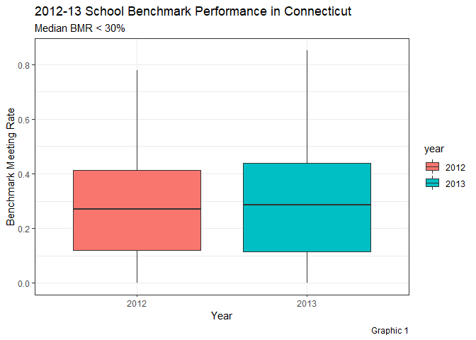
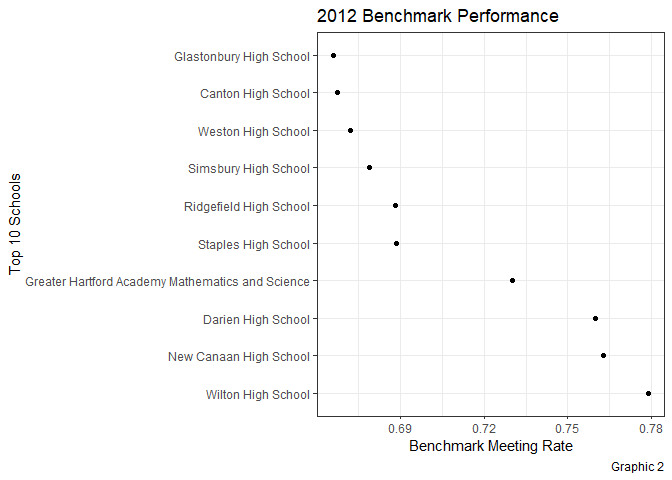
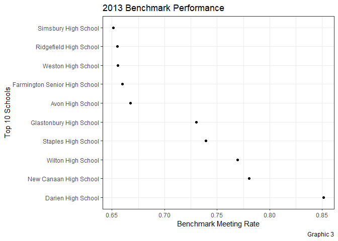
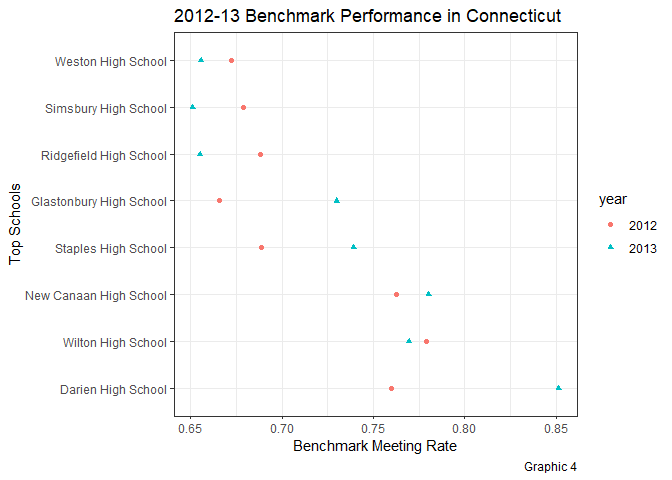

ZhangPeng-Project-2 part1
================

## 1\. Introduction

This project uses a primary dataset that contains SAT School
Participation and Performance informations limited to the state of
Connecticut in 2012 and 2013.

This dataset contains data by school on student SAT scores relative to
the SAT College and Career Readiness (CCR) Benchmark score of 1550
(critical reading, mathematics and writing sections combined) for the
graduating classes of 2012 and 2013. According to research conducted by
the College Board, a score of 1550 indicates that a student will have a
65 percent or greater likelihood of achieving a B- average or higher
during the first year of college.

This dataset also provides an estimated SAT Participation Rate, which
equals the number of SAT test-taking seniors in the school divided by
the number of seniors enrolled in the school as a percentage. These
participation rates are considered an estimate because the grade level
of the SAT test-taker is self-reported by the student at the time of
registration for the SAT while the total number of seniors enrolled in
the school is reported to the Connecticut State Department of Education
(CSDE) by the district. These are the best available estimates of SAT
participation rates.

The Benchmark Performance reflect the results of only those who
participate in the SAT. Because participation rates vary from school to
school, the CSDE provides both the estimated Participation rates
together with the Benchmark Performance in order to promote fair and
valid comparisons across schools.

So I would like to use a new index: Benchmark Meeting Rate(BMR) to
compare Benchmark Performance among all schools and districts related to
the dataset.This index equals the number of Benchmark-meeting seniors in
a school divided by the number of seniors enrolled in the school as a
percentage.

This report will try to analyze the distribution of Benchmark
Performance and its trend among the schools in Connecticut in 2012 and
2013 , then give some improving suggestions.

## 2\. Import and tidy dataset

Dataset (SAT\_School\_Participation\_and\_Performance\_\_2012-2013.csv)
has been downloaded from the link:
<https://catalog.data.gov/dataset/sat-school-participation-and-performance-2012-2013>.

Import this dataset to a new tibble
df.

``` r
df <- read_csv("D:/FTC2019FallSemester/datascience/R/project2/SAT_School_Participation_and_Performance__2012-2013.csv")#load the data set
```

    ## Parsed with column specification:
    ## cols(
    ##   `District Number` = col_double(),
    ##   District = col_character(),
    ##   School = col_character(),
    ##   `Test-takers: 2012` = col_double(),
    ##   `Test-takers: 2013` = col_double(),
    ##   `Test-takers: Change%` = col_double(),
    ##   `Participation Rate (estimate): 2012` = col_double(),
    ##   `Participation Rate (estimate): 2013` = col_double(),
    ##   `Participation Rate (estimate): Change%` = col_double(),
    ##   `Percent Meeting Benchmark: 2012` = col_double(),
    ##   `Percent Meeting Benchmark: 2013` = col_double(),
    ##   `Percent Meeting Benchmark: Change%` = col_double()
    ## )

``` r
glimpse(df)
```

    ## Observations: 197
    ## Variables: 12
    ## $ `District Number`                        <dbl> 26111, 46111, 76111, ...
    ## $ District                                 <chr> "Ansonia", "Avon", "B...
    ## $ School                                   <chr> "Ansonia High School"...
    ## $ `Test-takers: 2012`                      <dbl> 118, 254, 216, 200, 1...
    ## $ `Test-takers: 2013`                      <dbl> 104, 243, 220, 190, 1...
    ## $ `Test-takers: Change%`                   <dbl> -12, -4, 2, -5, 12, 1...
    ## $ `Participation Rate (estimate): 2012`    <dbl> 67, 90, 81, 86, 79, 1...
    ## $ `Participation Rate (estimate): 2013`    <dbl> 61, 89, 82, 82, 89, 1...
    ## $ `Participation Rate (estimate): Change%` <dbl> -6, -1, 1, -4, 10, 0,...
    ## $ `Percent Meeting Benchmark: 2012`        <dbl> 18, 73, 42, 51, 11, 7...
    ## $ `Percent Meeting Benchmark: 2013`        <dbl> 18, 75, 49, 49, 8, 7,...
    ## $ `Percent Meeting Benchmark: Change%`     <dbl> 0, 2, 7, -2, -3, 0, 2...

Then parse dataset df, find “District Number” can march “School”, and I
will caculate change trend later, so I remove the columns: “District
Number”,“Test-takers: Change%”, “Participation Rate (estimate):
Change%”, and “Percent Meeting Benchmark: Change%”; moreover remame
columns to
“district”,“school”,“t\_takes2012”,“t\_takes2013”,“part\_rate2012”,“part\_rate2013”,“perc\_mb2012”,“perc\_mb2013”;
finally drop off some rows with missing
values;

``` r
df <- df %>% select(-1, -6, -9, -12) %>% rename(district = "District", school = "School", t_takes2012 = "Test-takers: 2012", t_takes2013 = "Test-takers: 2013", part_rate2012 = "Participation Rate (estimate): 2012", part_rate2013 = "Participation Rate (estimate): 2013", perc_mb2012 = "Percent Meeting Benchmark: 2012", perc_mb2013 = "Percent Meeting Benchmark: 2013")
df <- df %>% filter(!(is.na(t_takes2012) | is.na(t_takes2013) | is.na(part_rate2012) | is.na(part_rate2013) | is.na(perc_mb2012) | is.na(perc_mb2013)))
df
```

    ## # A tibble: 187 x 8
    ##    district school t_takes2012 t_takes2013 part_rate2012 part_rate2013
    ##    <chr>    <chr>        <dbl>       <dbl>         <dbl>         <dbl>
    ##  1 Ansonia  Anson~         118         104            67            61
    ##  2 Avon     Avon ~         254         243            90            89
    ##  3 Berlin   Berli~         216         220            81            82
    ##  4 Bethel   Bethe~         200         190            86            82
    ##  5 Bloomfi~ Bloom~         116         130            79            89
    ##  6 Bloomfi~ Big P~          14          30           100           100
    ##  7 Bolton   Bolto~          62          70            85            96
    ##  8 Branford Branf~         196         213            77            84
    ##  9 Bridgep~ Bassi~         105         122            52            60
    ## 10 Bridgep~ Centr~         346         305            78            69
    ## # ... with 177 more rows, and 2 more variables: perc_mb2012 <dbl>,
    ## #   perc_mb2013 <dbl>

## 3\. Questions and findings

From the dataset,SAT Participation Rate is the number of SAT test-taking
seniors in the school divided by the number of seniors enrolled in the
school as a percentage; and variable Percent Meeting Benchmark only
refects the rate of the number of Benchmark-meeting seniors in a school
divided by the number of seniors who have taken SAT test in the school.
We still do not know the information of how many senior students had met
Benchmark from all seniors in a school.

To evalue Benchmark Performance for each school, I choose a new index:
Benchmark Meeting Rate(BMR), which comes from the number of
Benchmark-meeting seniors in a school divided by the number of all
seniors enrolled in the school.The formula for BMR of every school is
below: bmr = number of meeting Benchmark / number of total seniors =
(t\_takes*perc\_mb) / (t\_takes/part\_rate) = pec\_mb*part\_rate

Because in the dataset, both perc\_mb and part\_rate use % as unit, the
formula has been changed to : bmr = pec\_mb*part\_rate*1e-4

Next with the index BMR, I figure out three questions to understand the
Benchmark Performance among students in different schools and districts
from Connecticut in 2012 and 2013. Q1, what were BMRs for each school in
2012 and 2013 from Connecticut; Q2, which 10 schools had the highest
Benchmark Performance according to BMRs; Q3, which district had the
highest Benchmark Performance according to BMRs

### 3-1

Find BMRs for each school in 2012 and 2013 from
Connecticut

``` r
df1 <- df %>% select(1:4) %>% rename(`2012` = t_takes2012, `2013` = t_takes2013) %>% gather(3,4,key = "year", value = "t_takes")
df1
```

    ## # A tibble: 374 x 4
    ##    district   school                     year  t_takes
    ##    <chr>      <chr>                      <chr>   <dbl>
    ##  1 Ansonia    Ansonia High School        2012      118
    ##  2 Avon       Avon High School           2012      254
    ##  3 Berlin     Berlin High School         2012      216
    ##  4 Bethel     Bethel High School         2012      200
    ##  5 Bloomfield Bloomfield High School     2012      116
    ##  6 Bloomfield Big Picture High School    2012       14
    ##  7 Bolton     Bolton High School         2012       62
    ##  8 Branford   Branford High School       2012      196
    ##  9 Bridgeport Bassick High School        2012      105
    ## 10 Bridgeport Central Magnet High School 2012      346
    ## # ... with 364 more rows

``` r
df2 <- df %>% select(1,2,5,6) %>% rename(`2012` = part_rate2012, `2013` = part_rate2013) %>% gather(3,4,key = "year", value = "part_rate")
df2
```

    ## # A tibble: 374 x 4
    ##    district   school                     year  part_rate
    ##    <chr>      <chr>                      <chr>     <dbl>
    ##  1 Ansonia    Ansonia High School        2012         67
    ##  2 Avon       Avon High School           2012         90
    ##  3 Berlin     Berlin High School         2012         81
    ##  4 Bethel     Bethel High School         2012         86
    ##  5 Bloomfield Bloomfield High School     2012         79
    ##  6 Bloomfield Big Picture High School    2012        100
    ##  7 Bolton     Bolton High School         2012         85
    ##  8 Branford   Branford High School       2012         77
    ##  9 Bridgeport Bassick High School        2012         52
    ## 10 Bridgeport Central Magnet High School 2012         78
    ## # ... with 364 more rows

``` r
df3 <- df %>% select(1,2,7,8) %>% rename(`2012` = perc_mb2012, `2013` = perc_mb2013) %>% gather(3,4,key = "year", value = "perc_mb")
df3
```

    ## # A tibble: 374 x 4
    ##    district   school                     year  perc_mb
    ##    <chr>      <chr>                      <chr>   <dbl>
    ##  1 Ansonia    Ansonia High School        2012       18
    ##  2 Avon       Avon High School           2012       73
    ##  3 Berlin     Berlin High School         2012       42
    ##  4 Bethel     Bethel High School         2012       51
    ##  5 Bloomfield Bloomfield High School     2012       11
    ##  6 Bloomfield Big Picture High School    2012        7
    ##  7 Bolton     Bolton High School         2012       55
    ##  8 Branford   Branford High School       2012       47
    ##  9 Bridgeport Bassick High School        2012        3
    ## 10 Bridgeport Central Magnet High School 2012       14
    ## # ... with 364 more rows

``` r
df4 <- df1 %>% full_join(df2,by = c("district","school","year")) %>% full_join(df3,by = c("district","school","year"))
df4 <- df4 %>% mutate(bmr = perc_mb*part_rate*1e-4)
df4
```

    ## # A tibble: 374 x 7
    ##    district   school                 year  t_takes part_rate perc_mb    bmr
    ##    <chr>      <chr>                  <chr>   <dbl>     <dbl>   <dbl>  <dbl>
    ##  1 Ansonia    Ansonia High School    2012      118        67      18 0.121 
    ##  2 Avon       Avon High School       2012      254        90      73 0.657 
    ##  3 Berlin     Berlin High School     2012      216        81      42 0.340 
    ##  4 Bethel     Bethel High School     2012      200        86      51 0.439 
    ##  5 Bloomfield Bloomfield High School 2012      116        79      11 0.0869
    ##  6 Bloomfield Big Picture High Scho~ 2012       14       100       7 0.07  
    ##  7 Bolton     Bolton High School     2012       62        85      55 0.468 
    ##  8 Branford   Branford High School   2012      196        77      47 0.362 
    ##  9 Bridgeport Bassick High School    2012      105        52       3 0.0156
    ## 10 Bridgeport Central Magnet High S~ 2012      346        78      14 0.109 
    ## # ... with 364 more rows

``` r
df4 %>% 
  ggplot(aes(x = year, y = bmr, fill = year)) + 
  geom_boxplot() + labs(
    title = "2012-13 School Benchmark Performance in Connecticut",
    subtitle = "Median BMR < 30%",
    caption = "Graphic 1",
    y = "Benchmark Meeting Rate", x = "Year"
  ) + theme_bw()
```

<!-- -->

From the graphic above , in 2012 the BMRs of Connecticut schools
distributed from 0 to 80 percent, but in 2013 the rate went up
obviously, a couple of schools’ numbers almost touched 90 percent.

### 3-2

Find 10 schools had the highest Benchmark Performance according to BMRs;

``` r
df5 <- df4 %>% filter(year == 2012) %>% arrange(desc(bmr)) %>% head(10)
df5
```

    ## # A tibble: 10 x 7
    ##    district        school             year  t_takes part_rate perc_mb   bmr
    ##    <chr>           <chr>              <chr>   <dbl>     <dbl>   <dbl> <dbl>
    ##  1 Wilton          Wilton High School 2012      301        95      82 0.779
    ##  2 New Canaan      New Canaan High S~ 2012      306        93      82 0.763
    ##  3 Darien          Darien High School 2012      295        95      80 0.76 
    ##  4 Capitol Region~ Greater Hartford ~ 2012       22       100      73 0.73 
    ##  5 Westport        Staples High Scho~ 2012      363        85      81 0.688
    ##  6 Ridgefield      Ridgefield High S~ 2012      414        93      74 0.688
    ##  7 Simsbury        Simsbury High Sch~ 2012      383        93      73 0.679
    ##  8 Weston          Weston High School 2012      156        83      81 0.672
    ##  9 Canton          Canton High School 2012      106        89      75 0.668
    ## 10 Glastonbury     Glastonbury High ~ 2012      459        90      74 0.666

``` r
df5 %>% ggplot(aes(x= bmr, y= fct_reorder(school,-bmr))) + geom_point() + labs(title = "2012 Benchmark Performance", x = "Benchmark Meeting Rate", y = "Top 10 Schools", caption = "Graphic 2") + theme_bw()
```

<!-- -->

``` r
df6 <- df4 %>% filter(year == 2013) %>% arrange(desc(bmr)) %>% head(10)
df6
```

    ## # A tibble: 10 x 7
    ##    district    school                 year  t_takes part_rate perc_mb   bmr
    ##    <chr>       <chr>                  <chr>   <dbl>     <dbl>   <dbl> <dbl>
    ##  1 Darien      Darien High School     2013      307        99      86 0.851
    ##  2 New Canaan  New Canaan High School 2013      310        94      83 0.780
    ##  3 Wilton      Wilton High School     2013      300        95      81 0.770
    ##  4 Westport    Staples High School    2013      376        88      84 0.739
    ##  5 Glastonbury Glastonbury High Scho~ 2013      508       100      73 0.73 
    ##  6 Avon        Avon High School       2013      243        89      75 0.668
    ##  7 Farmington  Farmington Senior Hig~ 2013      282        97      68 0.660
    ##  8 Weston      Weston High School     2013      149        79      83 0.656
    ##  9 Ridgefield  Ridgefield High School 2013      375        84      78 0.655
    ## 10 Simsbury    Simsbury High School   2013      363        88      74 0.651

``` r
df6 %>% ggplot(aes(x= bmr, y= fct_reorder(school,-bmr))) + geom_point() + labs(title = "2013 Benchmark Performance", x = "Benchmark Meeting Rate", y = "Top 10 Schools", caption = "Graphic 3") + theme_bw()
```

<!-- -->

Let’s find top schools in both 2012 and 2013

``` r
df7 <- df5 %>% semi_join(df6, by = "school") %>% select(2,3,7)
df8 <- df6 %>% semi_join(df5, by = "school") %>% select(2,3,7)
df9 <- full_join(df7,df8, by = c("school", "year", "bmr"))
df9 %>% group_by(school) %>% mutate(mean = mean(bmr)) %>% ggplot(aes(x = bmr, y = fct_reorder(school,-mean), colour = year, shape = year)) + geom_point() + labs(title = "2012-13 Benchmark Performance in Connecticut", x = "Benchmark Meeting Rate", y = "Top Schools", caption = "Graphic 4") + theme_bw()
```

<!-- -->

### 3-3

Find districts had the highest Benchmark Performance according to BMRs

The top three districts in
2012

``` r
df4 %>% filter(year == 2012) %>% group_by(district) %>% summarise(bmr = mean(bmr)) %>% arrange(desc(bmr)) %>% head(3)
```

    ## # A tibble: 3 x 2
    ##   district     bmr
    ##   <chr>      <dbl>
    ## 1 Wilton     0.779
    ## 2 New Canaan 0.763
    ## 3 Darien     0.76

The top three districts in
2013

``` r
df4 %>% filter(year == 2013) %>% group_by(district) %>% summarise(bmr = mean(bmr)) %>% arrange(desc(bmr)) %>% head(3)
```

    ## # A tibble: 3 x 2
    ##   district     bmr
    ##   <chr>      <dbl>
    ## 1 Darien     0.851
    ## 2 New Canaan 0.780
    ## 3 Wilton     0.770

So there are the same three districts in both years, and let’s find
which schools in these
districts

``` r
df4 %>% select(1,2) %>% filter(district == c("Darien","New Canaan", "Wilton"))
```

    ## Warning in district == c("Darien", "New Canaan", "Wilton"): longer object
    ## length is not a multiple of shorter object length

    ## # A tibble: 3 x 2
    ##   district   school                
    ##   <chr>      <chr>                 
    ## 1 Darien     Darien High School    
    ## 2 Wilton     Wilton High School    
    ## 3 New Canaan New Canaan High School

## 4\. Conclusion

In Connecticut, the percents of Benchmark-Meeting seniors out of all
seniors in schools were low. For all schools median percent was lower
than 30%(refer to Graphic 1). In other words, a huge amount of students
would meet big challenge when they were studing during the first year of
college. But the situation was changing positively. Mean percent of
Benchmark-Meeting went up as well as more than 10 schools had kept BMR
over 65%(refer to Graphic 4).

To helping more senior students in high schools prepared for future
college life, we can think of more analysis on top Benchmark Performance
schools. Specially top three schools. They were Darien High
School,Wilton High School and New Canaan High School, from districts of
Darien,Wilton and New Canaan respectively.In two years of 2012 and 2013,
each school had over 75% senior students meeting Benchmark.

## 5\. Code

\#load the data

df \<-
read\_csv("D:/FTC2019FallSemester/datascience/R/project2/SAT\_School\_Participation\_and\_Performance\_\_2012-2013.csv")

\#tidy the data

df \<- df %\>% select(-1, -6, -9, -12) %\>% rename(district =
“District”, school = “School”, t\_takes2012 = “Test-takers: 2012”,
t\_takes2013 = “Test-takers: 2013”, part\_rate2012 = “Participation Rate
(estimate): 2012”, part\_rate2013 = “Participation Rate (estimate):
2013”, perc\_mb2012 = “Percent Meeting Benchmark: 2012”, perc\_mb2013
= “Percent Meeting Benchmark: 2013”) df \<- df %\>%
filter(\!(is.na(t\_takes2012) | is.na(t\_takes2013) |
is.na(part\_rate2012) | is.na(part\_rate2013) | is.na(perc\_mb2012) |
is.na(perc\_mb2013)))

\#add Benchmark Performance index-BMR column

df1 \<- df %\>% select(1:4) %\>% rename(`2012` = t\_takes2012, `2013` =
t\_takes2013) %\>% gather(3,4,key = “year”, value = “t\_takes”) df2 \<-
df %\>% select(1,2,5,6) %\>% rename(`2012` = part\_rate2012, `2013` =
part\_rate2013) %\>% gather(3,4,key = “year”, value = “part\_rate”) df3
\<- df %\>% select(1,2,7,8) %\>% rename(`2012` = perc\_mb2012, `2013` =
perc\_mb2013) %\>% gather(3,4,key = “year”, value = “perc\_mb”) df4 \<-
df1 %\>% full\_join(df2,by = c(“district”,“school”,“year”)) %\>%
full\_join(df3,by = c(“district”,“school”,“year”)) df4 \<- df4 %\>%
mutate(bmr = perc\_mb*part\_rate*1e-4)

\#visualize BMR vs. year variable

df4 %\>% ggplot(aes(x = year, y = bmr, fill = year)) + geom\_boxplot() +
labs( title = “2012-13 School Benchmark Performance in Connecticut”,
subtitle = “Median BMR \< 30%”, caption = “Graphic 1”, y = “Benchmark
Meeting Rate”, x = “Year” ) + theme\_bw()

\#find and visualize 2012 top 10 Benchmark Performance schools

df5 \<- df4 %\>% filter(year == 2012) %\>% arrange(desc(bmr)) %\>%
head(10) df5 %\>% ggplot(aes(x= bmr, y= fct\_reorder(school,-bmr))) +
geom\_point() + labs(title = “2012 Benchmark Performance in
Connecticut”, x = “Benchmark Meeting Rate”, y = “Top 10 Schools”,
caption = “Graphic 2”) + theme\_bw()

\#find and visualize 2013 top 10 Benchmark Performance schools

df6 \<- df4 %\>% filter(year == 2013) %\>% arrange(desc(bmr)) %\>%
head(10) df6 %\>% ggplot(aes(x= bmr, y= fct\_reorder(school,-bmr))) +
geom\_point() + labs(title = “2013 Benchmark Performance in
Connecticut”, x = “Benchmark Meeting Rate”, y = “Top 10 Schools”,
caption = “Graphic 3”) + theme\_bw()

\#find and visualize top Benchmark Performance schools in both 2012 and
2013

df7 \<- df5 %\>% semi\_join(df6, by = “school”) %\>% select(2,3,7) df8
\<- df6 %\>% semi\_join(df5, by = “school”) %\>% select(2,3,7) df9 \<-
full\_join(df7,df8, by = c(“school”, “year”, “bmr”)) df9 %\>%
group\_by(school) %\>% mutate(mean = mean(bmr)) %\>% ggplot(aes(x = bmr,
y = fct\_reorder(school,-mean), colour = year, shape = year)) +
geom\_point() + labs(title = “2012-13 Benchmark Performance in
Connecticut”, x = “Benchmark Meeting Rate”, y = “Top Schools”, caption =
“Graphic 4”) + theme\_bw()

\#find top three Benchmark Performance districts in 2012

df4 %\>% filter(year == 2012) %\>% group\_by(district) %\>%
summarise(bmr = mean(bmr)) %\>% arrange(desc(bmr)) %\>% head(3)

\#find top three Benchmark Performance districts in 2013

df4 %\>% filter(year == 2013) %\>% group\_by(district) %\>%
summarise(bmr = mean(bmr)) %\>% arrange(desc(bmr)) %\>% head(3)

\#find schools in top three Benchmark Performance districts

df4 %\>% select(1,2) %\>% filter(district == c(“Darien”,“New Canaan”,
“Wilton”))
